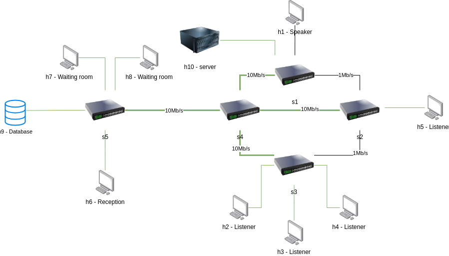

# On-Demand SDN Slicing
## Table of Contents
- [Project Description](#project-description)
    - [Key Technologies Used](#key-technologies-used)
- [Project Structure](#project-structure)
- [First Topology](#first-topology)
    - [Slices](#slices)
        - [Always On Mode](#always-on-mode)
        - [Listener Mode](#listener-mode)
        - [No Guest Mode](#no-guest-mode)
        - [Speaker Mode](#speaker-mode)
- [Second Topology](#second-topology)
    - [Slices](#slices-1)
        - [First Mode](#first-mode)
        - [Second Mode](#second-mode)
        - [Third Mode](#third-mode)
- [Running and Testing the Application](#running-and-testing-the-application)
    - [Running the Application in the GUI](#running-the-application-in-the-gui)
    - [Running the Application in the terminal](#running-the-application-in-the-terminal)
    - [Testing QoS (second topology)](#testing-qos-second-topology)
    - [Endpoints](#endpoints)
- [Authors](#authors)

## Project Description

This project aims to implement an on-demand slicing solution, with a web interface that interacts with a Ryu controller and a Mininet topology. The application allows the user to enable and disable different slices in the network, as well as to modify the QoS parameters of the network, by allocating different bandwidths to different queues which represent different types of traffic.

The project is divided into two topologies, each with its own controller. The first one allows the user to enable one slice at a time, while the second one allows the user to enable multiple slices at the same time and to modify the QoS parameters of the network.

### Key Technologies Used

The key technologies used in the project are:
- Comnetsemu: a network emulator that comes with all the necessary tools to run the project
- Mininet: a network emulator that allows the creation of a network topology
- Ryu: an SDN framework that provides a set of tools such as a controller and a REST API to interact with the network
- Python for the network anc controller logic
- HTML, CSS, and JavaScript for the web interface

## Project Structure
The structure of the project is as follows:
``` bash
├── docs_images
├── gui
│   ├── images
│   ├── index.html
│   ├── script.js
│   └── style.css
└── topologies
    ├── first_topology
    │   ├── controller.py
    │   ├── topology.py
    │   └── utils.py
    └── second_topology
        ├── controller.py
        ├── createQueue.sh
        ├── qos.py
        ├── qos_data
        │   ├── current_queues.txt
        │   ├── old_queues.txt
        │   └── stderr.txt
        ├── topology.py
        └── utils.p
```
- `docs_images` contains the images used for the documentation
- `gui/` contains the files to run the web interface
- `topologies/` contains the two topologies: `first_topology/` and `second_topology/`
    - each topology contains the following files
        - `controller.py`: contains the controller logic to handle the requests from the GUI and to interact with the mininet topology
        - `topology.py`: contains the mininet topology
        - `utils.py`: contains the utility functions used in the controller
    - `second_topology/` contains files related to QoS
        - `createQueue.sh`: script to create and delete queues
        - `qos.py`: calls `createQueue.sh`
        - `qos_data/`: contains the files to store the current and old queues, as well as the stderr output of the script

## First Topology

The structure of the first topology is the following:

- 10 hosts, of which one acts as a server and one as a database, numbered from h1 to h10
- 5 switches numbered from s1 to s5

The only hosts that can communicate with the database are the server and the reception.

### Slices

The slices that can be enabled in the first topology are:
- "Always On" mode
- "Listener" mode
- "No Guest" mode
- "Speaker" mode

In the following images, green links represent the active links, while black links represent the inactive links.

#### Always On Mode

The server and the database are the only hosts that can communicate with each other.


#### Listener Mode

All hosts can communicate when the speaker is inactive


#### No Guest Mode

Used when no one is in the waiting room, and the speaker is inactive


#### Speaker Mode

Allows the listeners to communicate only with the speaker


## Second Topology

The structure of the second Topology is the following:

- 10 hosts numbered from h1 to h10
- 5 switches numbered from s1 to s5

### Slices

The slices that can be enabled in the second topology are:
- "First" mode
- "Second" mode
- "Third" mode

In the following images, green links represent the active links, while black links represent the inactive links.

These slices can be enabled at the same time.

#### First Mode
Connects h1, h6 and h7 to each other


#### Second Mode
Connects h2, h5 and h8 to each other


#### Third Mode
Connects h3, h4, h9 and h10 to each other


## Running and Testing the Application

This section contains all the necessary commands to run and test the application. The application can be run either in the GUI or in the terminal.

The application can be run via [ComNetsEmu](https://git.comnets.net/public-repo/comnetsemu), or by instaling all the necessary requirements.


### Running the Application in the GUI
This section contains all the necessary commands to run and test the application inside the GUI
1. Running mininet
    - navigate to either `first_topology/` or `second_topology/`
    - execute `sudo python3 topology.py`
2. Running the controller:
    - navigate to either `first_topology/` or `second_topology/`
    - execute `sudo ryu-manager --wsapi-port 8081 controller.py`
3. Running the gui
    - navigate to the `gui/` directory
    - execute `python3 -m http.server 8080`

The GUI can be accessed at `http://localhost:8080/` and looks like this:

- It is possible select the topology and the slices to enable
- It is also possible to update the QoS parameters in the second topology

Note: it is important that you run mininet before running the controller, otherwise the controller will not be able to see the queues (in the second topology)

If you want to terminate the session, execute the following commands in the terminal with mininet:
1. `quit` to terminate the session
2. `sudo mn -c` to clean up

### Running the Application in the terminal
This section contains all the necessary commands to run and test the application inside the terminal
1. Running mininet
    - navigate to either `first_topology/` or `second_topology/`
    - execute `sudo python3 topology.py`
2. Running the controller:
    - navigate to either `first_topology/` or `second_topology/`
    - execute `sudo ryu-manager --wsapi-port 8081 controller.py`
3. Making requests to the controller:
    - execute `curl http://localhost:8081/controller/{option}/{slice_name}`
    - `{option}`: the accepted options are either `first` or `second`
    - `{slice_name}`: the accepted slices are defined in the [endpoints](#endpoints) section

Note: it is important that you run mininet before running the controller, otherwise the controller will not be able to see the queues (in the second topology)

If you want to terminate the session, execute the following commands in the terminal with mininet:
1. `quit` to terminate the session
2. `sudo mn -c` to clean up

### Testing QoS (second topology)

In the second topology there are 4 queues for each link:
- HTTP traffic on port 80
- DNS traffic on port 53
- ICMP traffic
- General traffic (all other types of traffic)

The queues's values can be set from the GUI:
- In the input box present in the second topology, enter three comma-separated values representing the bandwidth allocated respectively to HTTP, DNS, and ICMP. The remaining bandwidth on the link will be allocated to General traffic
- Each integer represents a MBps. For example, entering `1,5,3` will allocate 1MBps to HTTP, 5MBps to DNS, 3MBps to ICMP and 1MBps to General traffic
- Ensure that the total sum of the three allocated values does not exceed 10 as all the links have bandwidth 10MBps

To test HTTP run:
1. `<SERVER_HOST> iperf -s -p 80 &` to run a server `<SERVER_HOST>` on port 80
2. `<CLIENT_HOST> iperf -c <SERVER_HOST> -p 80` to run a client `<CLIENT_HOST>` that will connect to `<SERVER_HOST>`
- an example of the server and client hosts can be `h1` and `h6`


To test DNS run:
1. `<SERVER_HOST> iperf -s -u -p 53 &`
2. `<CLIENT_HOST> iperf -c <SERVER_HOST> -u -b 10m -p 53`
- Note: it is necessary to specify the bandwidth with `-b` for DNS traffic because it defaults to 1Mbps


Since ICMP is primarely used to check the reachability of hosts through the `ping`command, it is not possible to test it directly.

To test General traffic run:
1. `<SERVER_HOST> iperf -s -p 40 &` to run a server `<SERVER_HOST>` on port 40
2. `<CLIENT_HOST> iperf -c <SERVER_HOST> -p 40` to run a client `<CLIENT_HOST>` that will connect to `<SERVER_HOST>`
- Note: port 40 is just an example, you can use any other port that is not 80 or 53
- Note: the general traffic will use the remaining bandwidth, so to compute that you can use the formula:
    - `total_bandwidth - (http_bandwidth + dns_bandwidth + icmp_bandwidth)`
    - where `total_bandwidth` is the total bandwidth of the link, which is 10Mbps in this case


To list all queues run: `sudo ovs-vsctl list queue`

Note: the queues are automatically deleted whenever the new queues are created

### Endpoints

The slices for the first controller are exposed on URL `http://localhost:8081/controller/first/{slice_name}` and are:
- `always_on_mode`
- `listener_mode`
- `no_guest_mode`
- `speaker_mode`

The slices for the second controller are exposed on URL `http://localhost:8081/controller/second/{slice_name}` and are:
- `first_mode`
- `second_mode`
- `third_mode`

## Authors

- [Alessandro Fontana](https://github.com/MrAleFonta), [Davide Pedrotti](https://github.com/DavidePedrotti), [Leonardo Rigotti](https://github.com/leorigo2)