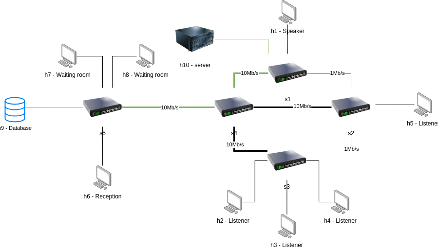

# On-Demand SDN Slicing
TODO: there are many duplicated descriptions, try to unify them if possible

TODO: add a brief description of the project (mentioning comnetsemu, mininet, ryu, etc.)

## Table of Contents
- [Project Description](#project-description)
- [Project Structure](#project-structure)
- [First Topology](#first-topology)
    - [Slices](#slices)
        - [Always On Mode](#always-on-mode)
        - [Listener Mode](#listener-mode)
        - [No Guest Mode](#no-guest-mode)
        - [Speaker Mode](#speaker-mode)
- [Second Topology](#second-topology)
    - [Slices](#slices-1)
        - [First Mode](#first-mode)
        - [Second Mode](#second-mode)
        - [Third Mode](#third-mode)
- [Running and Testing the Application](#running-and-testing-the-application)
    - [Running the Application in the GUI](#running-the-application-in-the-gui)
    - [Running the Application in the terminal](#running-the-application-in-the-terminal)
    - [Testing QoS (second topology)](#testing-qos-second-topology)
    - [Endpoints](#endpoints)
- [Authors](#authors)

## Project Description

This project aims to implement an on-demand slicing solution, with a web interface that interacts with a Ryu controller and a Mininet topology. The application allows the user to enable and disable different slices in the network, as well as to modify the QoS parameters of the network, by allocating different bandwidths to different queues which represent different types of traffic.

The project is divided into two topologies, each with its own controller. The first one allows the user to enable one slice at a time, while the second one allows the user to enable multiple slices at the same time and to modify the QoS parameters of the network.

## Project Structure
The structure of the project is as follows:
``` bash
├── gui
│   ├── images
│   ├── index.html
│   ├── script.js
│   └── style.css
└── topologies
    ├── first_topology
    │   ├── controller.py
    │   ├── topology.py
    │   └── utils.py
    └── second_topology
        ├── controller.py
        ├── createQueue.sh
        ├── qos.py
        ├── qos_data
        │   ├── current_queues.txt
        │   ├── old_queues.txt
        │   └── stderr.txt
        ├── topology.py
        └── utils.p
```
- `gui/` contains the files to run the web interface
- `topologies/` contains the two topologies: `first_topology/` and `second_topology/`
    - each topology contains the following files
        - `controller.py`: contains the controller logic to handle the requests from the GUI and to interact with the mininet topology
        - `topology.py`: contains the mininet topology
        - `utils.py`: contains the utility functions used in the controller
    - `second_topology/` contains files related to QoS
        - `createQueue.sh`: script to create and delete queues
        - `qos.py`: calls `createQueue.sh`
        - `qos_data/`: contains the files to store the current and old queues, as well as the stderr output of the script

## First Topology

The structure of the first topology is the following:

- 10 hosts, of which one acts as a server and one as a database, numbered from h1 to h10
- 5 switches numbered from s1 to s5

### Slices

The slices that can be enabled in the first topology are:
- "Always On" mode
- "Listener" mode
- "No Guest" mode
- "Speaker" mode

In the following images, green links represent the active links, while black links represent the inactive links.

TODO: add a description for each slice

#### Always On Mode

In this mode, the server and the database are the only hosts that can communicate with each other.


#### Listener Mode

The idea behind this mode is to allow all hosts to communicate when the speaker is inactive


#### No Guest Mode

This mode is ideally used when there is no one in the waiting room and the speaker is inactive


#### Speaker Mode


## Second Topology

The structure of the second Topology is the following:

- 10 hosts numbered from h1 to h10
- 5 switches numbered from s1 to s5

### Slices

The slices that can be enabled in the second topology are:
- "First" mode
- "Second" mode
- "Third" mode

In the following images, green links represent the active links, while black links represent the inactive links.

These slices can be enabled at the same time.

TODO: add a description for each slice

#### First Mode


#### Second Mode


#### Third Mode


## Running and Testing the Application

This section contains all the necessary commands to run and test the application. The application can be run either in the GUI or in the terminal.

TODO: add requirements to run the application

### Running the Application in the GUI
This section contains all the necessary commands to run and test the application inside the GUI
1. Running mininet
    - navigate to either `first_topology/` or `second_topology/`
    - execute `sudo python3 topology.py`
2. Running the controller:
    - navigate to either `first_topology/` or `second_topology/`
    - execute `sudo ryu-manager --wsapi-port 8081 controller.py`
3. Running the gui
    - navigate to the `gui/` directory
    - execute `python3 -m http.server 8080`

Note: it is important that you run mininet before running the controller, otherwise the controller will not be able to see the queues (in the second topology)

If you want to terminate the session, execute the following commands in the terminal with mininet:
1. `quit` to terminate the session
2. `sudo mn -c` to clean up

### Running the Application in the terminal
This section contains all the necessary commands to run and test the application inside the terminal
1. Running mininet
    - navigate to either `first_topology/` or `second_topology/`
    - execute `sudo python3 topology.py`
2. Running the controller:
    - navigate to either `first_topology/` or `second_topology/`
    - execute `sudo ryu-manager --wsapi-port 8081 controller.py`
3. Making requests to the controller:
    - execute `curl http://localhost:8081/controller/{option}/{slice_name}`
    - `{option}`: the accepted options are either `first` or `second`
    - `{slice_name}`: the accepted slices are defined in the [endpoints](#endpoints) section

Note: it is important that you run mininet before running the controller, otherwise the controller will not be able to see the queues (in the second topology)

If you want to terminate the session, execute the following commands in the terminal with mininet:
1. `quit` to terminate the session
2. `sudo mn -c` to clean up

### Testing QoS (second topology)

In the second topology there are 3 queues for each link:
- TCP traffic on port 80
- UDP traffic on port 53
- TODO: add missing one

To test TCP run:
1. `h5 iperf -s -p 80 &` to run a server `h5` on port 80
2. `h6 iperf -c h5 -p 80` to run a client `h6` that will connect to `h5`

To test UDP run:
1. `h5 iperf -s -u -p 53 &`
2. `h6 iperf -c h5 -u -b 10m -p 53`
- Note: it is necessary to specify the bandwidth with `-b` for UDP traffic because it defaults to 1Mbps

To list all queues run: `sudo ovs-vsctl list queue`

Note: the queues are automatically deleted whenever the new queues are created

TODO: add screenshots of the GUI and the terminal commands

### Endpoints

The endpoints for the first controller are exposed on URL `http://localhost:8081/controller/first` and are:
- `always_on_mode`
- `listener_mode`
- `no_guest_mode`
- `speaker_mode`

The endpoints for the second controller are exposed on URL `http://localhost:8081/controller/second` and are:
- `first_mode`
- `second_mode`
- `third_mode`

## Authors

- [Alessandro Fontana](https://github.com/MrAleFonta), [Davide Pedrotti](https://github.com/DavidePedrotti), [Leonardo Rigotti](https://github.com/leorigo2)